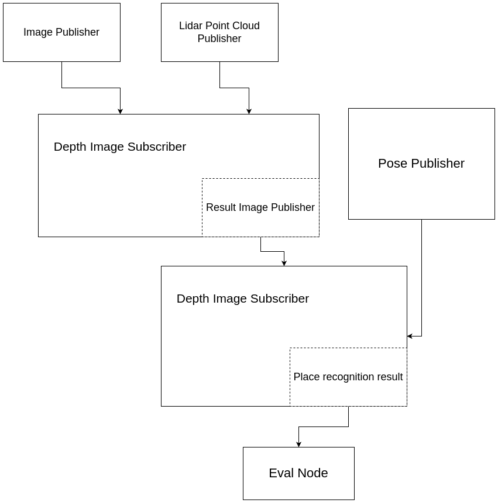

# ICP_Loop_clousre!


Plan on Nodes of place recognition module with the table, that shows what node is done.

✅ - Done

❌ - Not done

✅❌ - Needs reworking

WIP - work in progress

| Node                               | Done |
|------------------------------------|------|
| Image publisher                    | ✅    |
| Poser publisher                    | ✅    |
| Depth image subscriber             | WIP  |
| Depth image publisher              | ❌    |
| Place recognition subscriber       | ✅❌   |
| Place recognition result publisher | ❌    |
| Val Node                           | ❌    |





Run code via Docker
```bash
docker-compose up --build
```

## TBA
- scripts to run everything
- Create interface to run experiments with various depth completion models
- Make experiments with [CostDCNet](https://github.com/kamse/CostDCNet) (Problem is MinkowskiEngine)
- Make experiments with [PENet](https://github.com/JUGGHM/PENet_ICRA2021)
